# مخططات قاعدة البيانات - مشروع Musad Bot N8N

## نظرة عامة

هذا المستند يحتوي على مخططات ERD مفصلة لقاعدة البيانات المستخدمة في مشروع Musad Bot N8N. قاعدة البيانات تستخدم MongoDB مع Mongoose ODM.

## الجداول الرئيسية

### 1. جدول المستخدمين (Users)

### 2. جدول التجار (Merchants)

### 3. جدول المنتجات (Products)

### 4. جدول الفئات (Categories)

### 5. جدول الطلبات (Orders)

### 6. جدول الخطط (Plans)

```mermaid
erDiagram
    Plan {
        ObjectId _id PK
        string name UK "فريد، مطلوب، مفهرس"
        number priceCents "مطلوب، الحد الأدنى: 0"
        enum currency "USD, SAR, AED, YER - افتراضي: USD"
        number durationDays "مطلوب، الحد الأدنى: 1"
        number messageLimit "افتراضي: 100، الحد الأدنى: 0"
        boolean llmEnabled "افتراضي: true"
        boolean isTrial "افتراضي: false، مفهرس"
        boolean isActive "افتراضي: true، مفهرس"
        string description "اختياري"
        array features "افتراضي: []"
        enum billingPeriod "monthly, annual - افتراضي: monthly"
        number trialPeriodDays "افتراضي: 0، الحد الأدنى: 0"
        boolean archived "افتراضي: false، مفهرس"
        Date createdAt "تلقائي"
        Date updatedAt "تلقائي"
    }
```

### 7. جدول تذاكر الدعم (Support Tickets)

### 8. جدول الأسئلة الشائعة (FAQs)

### 9. جدول أسئلة البوت (Bot FAQs)

### 10. جدول الرسائل (Message Sessions)

### 11. جدول العملاء المحتملين (Leads)

### 12. جدول الوثائق (Documents)

### 13. مخطط خطة الاشتراك (Subscription Plan)

## العلاقات بين الجداول

### العلاقات الرئيسية:

1. **User ↔ Merchant**: علاقة واحد لواحد

   - `User.merchantId` → `Merchant._id`
   - `Merchant.userId` → `User._id`

2. **Merchant ↔ Product**: علاقة واحد لكثير

   - `Product.merchantId` → `Merchant._id`

3. **Merchant ↔ Category**: علاقة واحد لكثير

   - `Category.merchantId` → `Merchant._id`

4. **Category ↔ Category**: علاقة ذاتية (Parent-Child)

   - `Category.parent` → `Category._id`

5. **Product ↔ Category**: علاقة كثير لواحد

   - `Product.category` → `Category._id`

6. **Merchant ↔ Order**: علاقة واحد لكثير

   - `Order.merchantId` → `Merchant._id` (string reference)

7. **Merchant ↔ SupportTicket**: علاقة واحد لكثير

   - `SupportTicket.merchantId` → `Merchant._id`

8. **User ↔ SupportTicket**: علاقة واحد لكثير

   - `SupportTicket.createdBy` → `User._id`

9. **Merchant ↔ MessageSession**: علاقة واحد لكثير

   - `MessageSession.merchantId` → `Merchant._id`

10. **User ↔ SingleMessage**: علاقة واحد لكثير (للتصنيف)

    - `SingleMessage.ratedBy` → `User._id`

11. **Merchant ↔ Lead**: علاقة واحد لكثير

    - `Lead.merchantId` → `Merchant._id` (string reference)

12. **Merchant ↔ Faq**: علاقة واحد لكثير

    - `Faq.merchantId` → `Merchant._id` (string reference)

13. **Merchant ↔ Document**: علاقة واحد لكثير

    - `Document.merchantId` → `Merchant._id` (string reference)

14. **Plan ↔ SubscriptionPlan**: علاقة واحد لواحد
    - `SubscriptionPlan.planId` → `Plan._id`

## الفهارس (Indexes)

### فهارس مهمة:

1. **User**:

   - `email` (unique, index)
   - `active` (index)

2. **Merchant**:

   - `publicSlug` (unique, index)

3. **Category**:

   - `merchantId + parent + slug` (unique)
   - `merchantId + path`
   - `merchantId + ancestors`
   - `merchantId + depth`

4. **Product**:

   - `uniqueKey` (unique, sparse)

5. **SupportTicket**:

   - `ticketNumber` (unique, index)
   - `createdAt` (descending)
   - `email + createdAt` (descending)

6. **BotFaq**:

   - `status + updatedAt` (descending)

7. **Faq**:

   - `merchantId + status + createdAt` (descending)

8. **Lead**:

   - `merchantId + phoneNormalized`
   - `merchantId + sessionId`

9. **Plan**:
   - `isActive + priceCents`

## ملاحظات مهمة

### أنواع البيانات:

- **ObjectId**: معرف فريد في MongoDB
- **enum**: قيم محددة مسبقاً
- **array**: مصفوفة من العناصر
- **object**: كائن JSON
- **Date**: تاريخ ووقت
- **string/number/boolean**: أنواع البيانات الأساسية

### القيود:

- **UK**: فريد (Unique Key)
- **PK**: المفتاح الأساسي (Primary Key)
- **FK**: المفتاح الخارجي (Foreign Key)
- **مطلوب**: حقل إجباري
- **اختياري**: حقل اختياري
- **افتراضي**: قيمة افتراضية

### أنماط التصميم:

- **Soft Delete**: استخدام `deletedAt` للحذف الناعم
- **Timestamps**: `createdAt` و `updatedAt` تلقائياً
- **Audit Trail**: تتبع التغييرات والأنشطة
- **Nested Schemas**: استخدام مخططات فرعية للبيانات المعقدة

## قواعد البيانات الخارجية

### Qdrant (Vector Database):

- **Collection: products**: منتجات مع embeddings
- **Collection: offers**: عروض المنتجات
- **Collection: faqs**: أسئلة شائعة مع embeddings
- **Collection: documents**: وثائق مع embeddings
- **Collection: bot_faqs**: أسئلة البوت مع embeddings
- **Collection: web_knowledge**: معرفة الويب

### Redis:

- تخزين مؤقت للجلسات
- تخزين مؤقت للبيانات المؤقتة

### RabbitMQ:

- طوابير المعالجة
- رسائل النظام

---

_تم إنشاء هذا المستند بناءً على تحليل كود المشروع الحالي_
