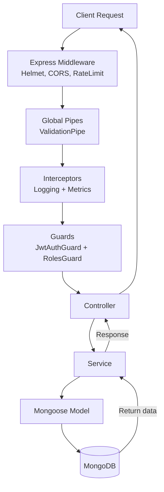

# Request Flow

This document explains how an incoming HTTP request is processed inside the application until it reaches the database. The flow applies to all API routes (e.g. `/api/users`).

## Steps
1. **Client Request** – The client sends an HTTP request to an API endpoint under `/api`.
2. **Express Middleware** – Helmet secures headers, CORS is applied and rate limiting limits requests.
3. **Validation Pipe** – The `ValidationPipe` validates and transforms incoming DTOs.
4. **Interceptors** – The `LoggingInterceptor` logs request/response details and `HttpMetricsInterceptor` records Prometheus metrics.
5. **Guards** – `JwtAuthGuard` verifies the JWT token and `RolesGuard` checks role permissions.
6. **Controller** – The request is routed to the appropriate controller method (for example `UsersController`).
7. **Service** – Controllers delegate business logic to services (for example `UsersService`).
8. **Mongoose Model** – Services use injected Mongoose models to execute MongoDB queries.
9. **MongoDB** – The database returns the result, which flows back through the service and controller to the client.
