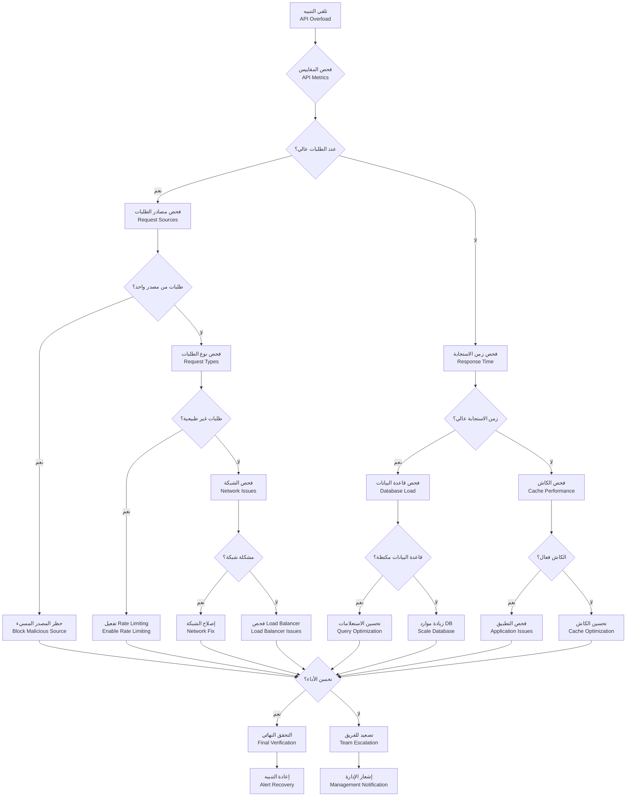
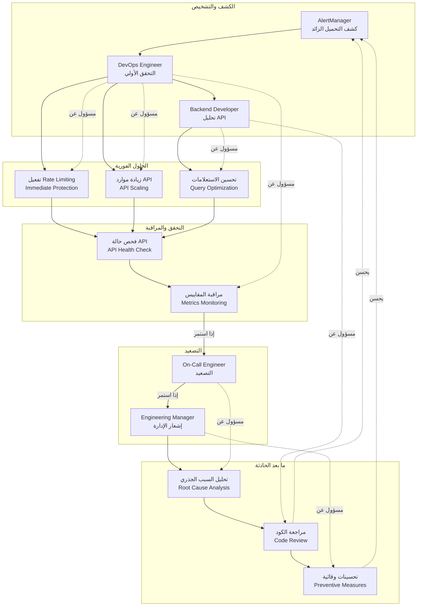

# Runbook — API Overload (تحميل زائد على API)

## نظرة عامة

حادث: زيادة مفاجئة في طلبات API تؤدي لتدهور الأداء أو فشل الخدمة.

**الأولوية**: حرجة (P0) - يوقف الخدمة للمستخدمين
**MTTR هدف**: 5 دقائق
**MTTD هدف**: 1 دقيقة

## مخطط الإجراءات (Action Flowchart)



## مخطط مسؤوليات الفريق (Team Responsibilities Swimlane)



## الأعراض والكشف

### الأعراض الرئيسية

- **تنبيهات Grafana**: `http_requests_total > 10000` أو `response_time > 2s`
- **بطء في الاستجابة**: زمن استجابة أطول من 2 ثانية
- **أخطاء 5xx**: زيادة في معدل الأخطاء
- **ارتفاع استخدام CPU**: لخوادم API

### كيفية الكشف

```yaml
# alerts/api-overload.yml
groups:
  - name: api
    rules:
      - alert: APIOverloadDetected
        expr: |
          (rate(http_requests_total[5m]) > 10000) OR
          (histogram_quantile(0.95, rate(http_request_duration_seconds_bucket[5m])) > 2)
        for: 2m
        labels:
          severity: critical
        annotations:
          summary: 'تحميل زائد على API'
          runbook_url: 'https://kb.kaleem-ai.com/runbooks/api-overload-incident'
```

## خطوات الحل

### الحلول الفورية (المستوى 1)

```bash
# تفعيل Rate Limiting
kubectl patch deployment kaleem-api -p '{"spec":{"template":{"spec":{"containers":[{"name":"kaleem-api","env":[{"name":"RATE_LIMIT_ENABLED","value":"true"}]}]}}}}'

# زيادة موارد API
kubectl scale deployment kaleem-api --replicas=5

# حظر IPs المسيئة
kubectl exec nginx-pod -- iptables -A INPUT -s 192.168.1.100 -j DROP
```

### الحلول المتقدمة (المستوى 2)

```typescript
// تحسين الاستعلامات
async getOptimizedData(query: any) {
  // استخدام database indexes
  // تقليل عدد الاستعلامات
  // إضافة pagination
}
```

## التحقق والمراقبة

```bash
# فحص حالة API
curl http://localhost:3000/health

# فحص المقاييس
curl http://localhost:3000/metrics | grep http

# فحص Load Balancer
kubectl get svc nginx-service
```

---

_تم إنشاء هذا الـ runbook بواسطة فريق العمليات في كليم_
