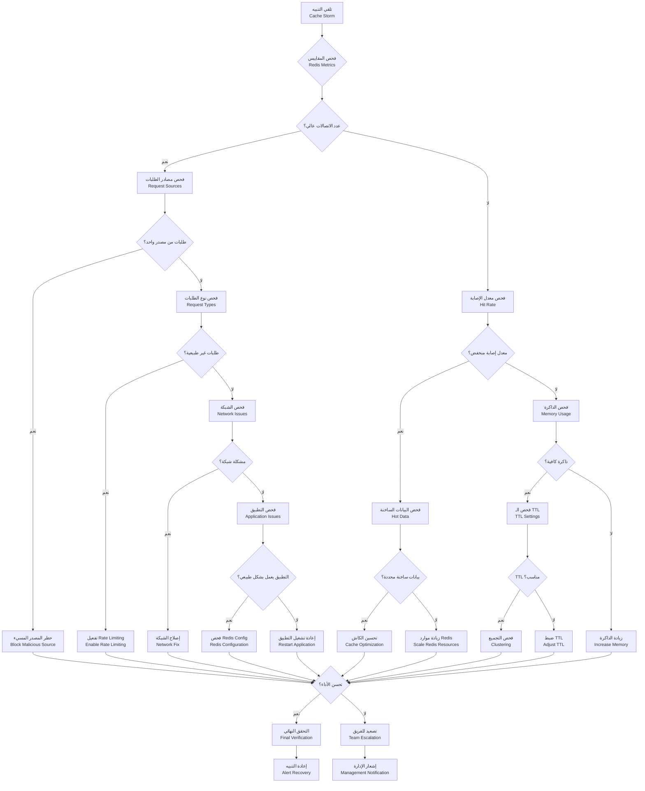
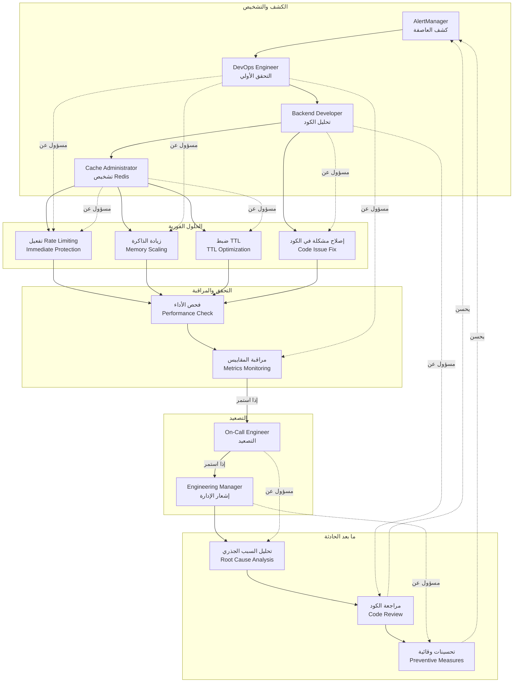

# Runbook — Cache Storm (عاصفة الكاش - زيادة طلبات الكاش المفاجئة)

## نظرة عامة

حادث حرج: زيادة مفاجئة وشديدة في طلبات الكاش (Redis/Cache Service) تؤدي لتدهور الأداء أو فشل الخدمة.

**الأولوية**: عالية (P1) - يؤثر على الأداء بشكل كبير
**MTTR هدف**: 10 دقائق
**MTTD هدف**: 1 دقيقة

## 1. مخطط الإجراءات (Action Flowchart)



## 2. مخطط مسؤوليات الفريق (Team Responsibilities Swimlane)



## 3. الأعراض والكشف

### 3.1 الأعراض الرئيسية

- **تنبيهات Grafana**: `redis_connections > 1000` أو `cache_miss_rate > 0.8`
- **بطء في الاستجابة**: زمن استجابة أعلى من 2 ثانية
- **أخطاء في التطبيق**: Redis connection timeout أو cache errors
- **زيادة في استخدام CPU**: لخادم Redis أو التطبيق
- **تراكم في الطوابير**: زيادة في عدد الطلبات المعلقة

### 3.2 كيفية الكشف

```yaml
# alerts/cache-storm.yml
groups:
  - name: cache
    rules:
      - alert: CacheStormDetected
        expr: |
          (redis_connections > 1000) OR
          (rate(cache_operations_total[5m]) > 10000)
        for: 2m
        labels:
          severity: warning
        annotations:
          summary: 'عاصفة كاش مكتشفة'
          runbook_url: 'https://kb.kaleem-ai.com/runbooks/cache-storm-incident'

      - alert: CacheMissSpike
        expr: |
          rate(cache_miss_total[5m]) / rate(cache_operations_total[5m]) > 0.8
        for: 3m
        labels:
          severity: critical
        annotations:
          summary: 'زيادة كبيرة في فشل الكاش'
```

## 4. التشخيص السريع

### 4.1 فحص حالة Redis

```bash
# فحص الاتصالات
redis-cli info clients

# فحص الذاكرة
redis-cli info memory

# فحص العمليات
redis-cli --hotkeys
```

### 4.2 فحص التطبيق

```bash
# فحص معدل الإصابة
curl http://localhost:3000/metrics | grep cache_hit_rate

# فحص عدد العمليات
redis-cli info stats
```

### 4.3 فحص المصادر

```bash
# فحص الطلبات حسب المصدر
redis-cli client list

# فحص الأوامر الأكثر استخداماً
redis-cli --bigkeys
```

## 5. خطوات الحل

### 5.1 الحلول الفورية (المستوى 1)

#### 5.1.1 تفعيل Rate Limiting

```typescript
// src/common/middleware/rate-limit.middleware.ts
export class RateLimitMiddleware {
  private cache = new Map<string, { count: number; resetTime: number }>();

  use(req: Request, res: Response, next: NextFunction) {
    const key = req.ip;
    const now = Date.now();
    const windowMs = 15 * 60 * 1000; // 15 minutes
    const maxRequests = 100;

    const client = this.cache.get(key);

    if (!client || now > client.resetTime) {
      this.cache.set(key, { count: 1, resetTime: now + windowMs });
      return next();
    }

    if (client.count >= maxRequests) {
      return res.status(429).json({ error: 'Too many requests' });
    }

    client.count++;
    next();
  }
}
```

#### 5.1.2 زيادة موارد Redis

```bash
# Kubernetes
kubectl patch deployment redis -p '{"spec":{"template":{"spec":{"containers":[{"name":"redis","resources":{"limits":{"memory":"2Gi","cpu":"1000m"}}}]}}}}}'

# Docker
docker update --memory 2g --cpus 1 redis
```

#### 5.1.3 حظر المصادر المسيئة

```typescript
// src/common/middleware/blocklist.middleware.ts
export class BlocklistMiddleware {
  private blocklist = new Set<string>();

  async use(req: Request, res: Response, next: NextFunction) {
    const ip = req.ip;

    if (this.blocklist.has(ip)) {
      return res.status(403).json({ error: 'IP blocked' });
    }

    // فحص إذا كان المصدر مسيئاً
    if (await this.isMalicious(ip)) {
      this.blocklist.add(ip);
      return res.status(403).json({ error: 'IP blocked' });
    }

    next();
  }
}
```

### 5.2 الحلول المتقدمة (المستوى 2)

#### 5.2.1 تحسين الكاش

```typescript
// src/common/cache/cache.service.ts
async optimizeCache() {
  // 1. حذف المفاتيح المنتهية الصلاحية
  await this.redis.del(...expiredKeys);

  // 2. ضبط TTL للمفاتيح الساخنة
  await this.redis.expire(hotKeys, newTTL);

  // 3. إعادة توزيع الذاكرة
  await this.redis.configSet('maxmemory-policy', 'allkeys-lru');
}
```

#### 5.2.2 تحسين الاستعلامات

```typescript
// تحسين الاستعلامات في التطبيق
async getDataOptimized(key: string) {
  // استخدام pipeline لتقليل round trips
  const pipeline = this.redis.pipeline();

  pipeline.get(key);
  pipeline.exists(`${key}:metadata`);
  pipeline.expire(key, 3600);

  const results = await pipeline.exec();
  return results[0][1]; // القيمة من GET
}
```

### 5.3 الحلول الجذرية (المستوى 3)

#### 5.3.1 إعداد Redis Cluster

```bash
# إعداد Redis Cluster
redis-cli --cluster create \
  192.168.1.10:7000 \
  192.168.1.11:7001 \
  192.168.1.12:7002 \
  --cluster-replicas 1
```

#### 5.3.2 تحسين بنية التطبيق

```typescript
// إضافة caching layer إضافية
class MultiLayerCache {
  private l1 = new Map(); // In-memory
  private l2: Redis; // Distributed
  private l3: Database; // Persistent

  async get(key: string) {
    // L1: Memory (fastest)
    const l1Result = this.l1.get(key);
    if (l1Result) return l1Result;

    // L2: Redis (fast)
    const l2Result = await this.l2.get(key);
    if (l2Result) {
      this.l1.set(key, l2Result); // Promote to L1
      return l2Result;
    }

    // L3: Database (slowest)
    const l3Result = await this.l3.get(key);
    await this.l2.set(key, l3Result, 'EX', 3600); // Cache in L2
    return l3Result;
  }
}
```

## 6. التحقق والمراقبة

### 6.1 التحقق من الحل

```bash
# فحص حالة Redis
redis-cli ping
redis-cli info memory
redis-cli info clients

# فحص معدل الإصابة
curl http://localhost:3000/metrics | grep cache_hit_rate

# فحص زمن الاستجابة
redis-cli --latency
```

### 6.2 مراقبة ما بعد الحادثة

```yaml
# مقاييس للمراقبة
- redis_up
- redis_connections
- redis_memory_used
- redis_commands_processed
- cache_hit_rate
- cache_operations_total
- cache_miss_total
- application_response_time
```

## 7. ما بعد الحادثة

### 7.1 تحليل السبب الجذري (RCA)

#### الأسئلة الرئيسية:

1. ما الذي تسبب في العاصفة؟
2. هل كانت هجوم DDoS؟
3. هل كان خطأ في الكود؟
4. هل كان تحديث في البيانات؟

#### أدوات التحليل:

- **Grafana**: تحليل أنماط الطلبات
- **Redis Monitor**: مراقبة الأوامر
- **Application Logs**: فحص سجلات التطبيق
- **Network Logs**: تحليل حركة الشبكة

### 7.2 الدروس المستفادة

#### من الحوادث السابقة:

- **Rate Limiting**: يجب تفعيله دائماً
- **مراقبة متقدمة**: تحتاج للكشف المبكر
- **تحسين الكاش**: يحتاج مراجعة دورية
- **التدريب**: الفريق يحتاج تدريب على إدارة العواصف

### 7.3 التحسينات المطلوبة

#### فورية:

- [ ] تفعيل Rate Limiting تلقائي
- [ ] تحسين خوارزميات الكاش
- [ ] إضافة تنبيهات إضافية

#### طويلة الأمد:

- [ ] إعداد Redis Cluster
- [ ] تحسين استراتيجية التخزين المؤقت
- [ ] إضافة طبقة كاش إضافية
- [ ] تدريب الفريق على إدارة العواصف

## 8. الأدوات والمراجع

### 8.1 أدوات التشخيص

```bash
# Redis monitoring
redis-cli monitor
redis-cli --scan --pattern "user:*" | head -20

# Cache analysis
redis-cli --bigkeys
redis-cli --hotkeys

# Memory analysis
redis-cli memory usage key
redis-cli memory stats
```

### 8.2 مراجع مفيدة

- [Redis Documentation](https://redis.io/documentation)
- [Redis Performance](https://redis.io/topics/benchmarks)
- [Cache Storm Prevention](https://redis.io/topics/security)

## 9. الاتصال والتصعيد

### 9.1 قنوات الاتصال

- **Slack**: `#cache-alerts` للتنبيهات
- **Slack**: `#backend-team` للمناقشات الفنية
- **Email**: cache-team@kaleem-ai.com للتصعيد
- **Phone**: قائمة الاتصال الطارئ للفريق

### 9.2 جدول التصعيد

| الوقت      | الإجراء     | المسؤول             |
| ---------- | ----------- | ------------------- |
| 0-2 دقيقة  | تشخيص أولي  | DevOps Engineer     |
| 2-5 دقائق  | حلول فورية  | Backend Developer   |
| 5-10 دقائق | حلول متقدمة | Cache Administrator |
| 10+ دقيقة  | تصعيد       | On-Call Engineer    |

---

_تم إنشاء هذا الـ runbook بواسطة فريق الهندسة في كليم_
