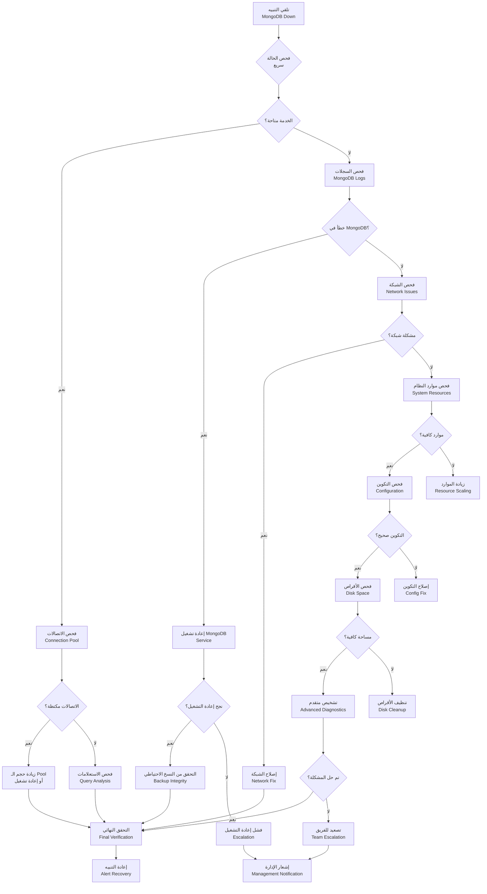
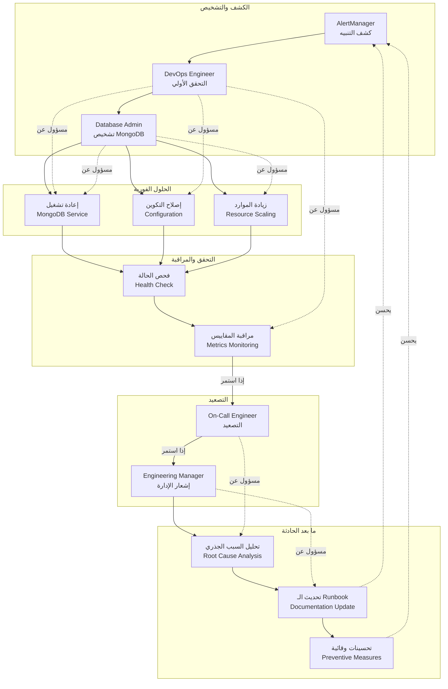

# Runbook — Database Down (قاعدة البيانات معطلة)

## نظرة عامة

حادث حرج: قاعدة البيانات (MongoDB) غير متاحة مما يؤثر على جميع عمليات القراءة والكتابة.

**الأولوية**: حرجة (P0) - يوقف النظام بالكامل
**MTTR هدف**: 15 دقيقة
**MTTD هدف**: 2 دقيقة

## 1. مخطط الإجراءات (Action Flowchart)



## 2. مخطط مسؤوليات الفريق (Team Responsibilities Swimlane)



## 3. الأعراض والكشف

### 3.1 الأعراض الرئيسية

- **تنبيهات Grafana**: `mongodb_up == 0` لأكثر من 30 ثانية
- **أخطاء في التطبيق**: 500 Internal Server Error لجميع الطلبات
- **سجلات الأخطاء**: MongoNetworkError أو MongoTimeoutError
- **تأثير المستخدمين**: عدم القدرة على تسجيل الدخول أو حفظ البيانات

### 3.2 كيفية الكشف

```yaml
# alerts/db-down.yml
groups:
  - name: database
    rules:
      - alert: MongoDBDown
        expr: mongodb_up == 0
        for: 30s
        labels:
          severity: critical
        annotations:
          summary: 'MongoDB غير متاح'
          runbook_url: 'https://kb.kaleem-ai.com/runbooks/db-down-incident'
```

## 4. التشخيص السريع

### 4.1 فحص حالة الخدمة

```bash
# فحص حالة MongoDB
kubectl get pods -l app=mongodb
# أو
docker ps | grep mongodb

# فحص السجلات
kubectl logs -l app=mongodb --tail=50
# أو
docker logs mongodb
```

### 4.2 فحص الاتصالات

```bash
# MongoDB shell
mongosh --eval "db.serverStatus().connections"

# فحص الاتصالات المفتوحة
mongosh --eval "db.currentOp()"
```

### 4.3 فحص الموارد

```bash
# موارد النظام
kubectl top pods -l app=mongodb
# أو
docker stats mongodb

# مساحة الأقراص
df -h /data/db
```

### 4.4 فحص الشبكة

```bash
# اختبار الاتصال
telnet mongodb-host 27017

# فحص المنافذ
netstat -tlnp | grep 27017
```

## 5. خطوات الحل

### 5.1 الحلول الفورية (المستوى 1)

#### 5.1.1 إعادة تشغيل الخدمة

```bash
# Kubernetes
kubectl delete pod -l app=mongodb
# أو
kubectl rollout restart deployment/mongodb

# Docker
docker restart mongodb
```

#### 5.1.2 فحص وإصلاح التكوين

```bash
# فحص ملف التكوين
cat /etc/mongod.conf

# إعادة تحميل التكوين
kubectl exec mongodb-pod -- mongod --config /etc/mongod.conf --shutdown
kubectl exec mongodb-pod -- mongod --config /etc/mongod.conf
```

#### 5.1.3 زيادة الموارد

```bash
# زيادة الذاكرة
kubectl patch deployment mongodb -p '{"spec":{"template":{"spec":{"containers":[{"name":"mongodb","resources":{"limits":{"memory":"4Gi"}}}]}}}}}'

# زيادة CPU
kubectl patch deployment mongodb -p '{"spec":{"template":{"spec":{"containers":[{"name":"mongodb","resources":{"limits":{"cpu":"2000m"}}}]}}}}}'
```

### 5.2 الحلول المتقدمة (المستوى 2)

#### 5.2.1 استعادة من النسخ الاحتياطي

```bash
# إيقاف التطبيق مؤقتاً
kubectl scale deployment kaleem-api --replicas=0

# استعادة البيانات
mongorestore --host mongodb --db kaleem /backup/kaleem

# إعادة تشغيل التطبيق
kubectl scale deployment kaleem-api --replicas=3
```

#### 5.2.2 نقل لقاعدة بيانات احتياطية

```bash
# تحديث DNS أو Load Balancer
# للتوجيه لقاعدة البيانات الاحتياطية

# فحص حالة المزامنة
rs.status() # في MongoDB Replica Set
```

### 5.3 الحلول الجذرية (المستوى 3)

#### 5.3.1 ترقية MongoDB

```bash
# نسخ احتياطي كامل
mongodump --out /backup/full-$(date +%Y%m%d-%H%M%S)

# تحديث النسخة
helm upgrade mongodb bitnami/mongodb --version 14.0.0

# فحص التوافق
mongosh --eval "db.version()"
```

#### 5.3.2 إعادة تصميم البنية التحتية

```bash
# إضافة Replica Set
# إعداد MongoDB Sharding
# نقل لـ MongoDB Atlas
```

## 6. التحقق والمراقبة

### 6.1 التحقق من الحل

```bash
# فحص حالة MongoDB
mongosh --eval "db.serverStatus().ok"

# فحص الاتصالات
mongosh --eval "db.currentOp()"

# فحص الأداء
mongosh --eval "db.serverStatus().connections"
```

### 6.2 مراقبة ما بعد الحادثة

```yaml
# مقاييس للمراقبة
- mongodb_up
- mongodb_connections_current
- mongodb_connections_available
- mongodb_operation_time
- mongodb_page_faults
- mongodb_asserts
```

## 7. ما بعد الحادثة

### 7.1 تحليل السبب الجذري (RCA)

#### الأسئلة الرئيسية:

1. ما الذي حدث بالضبط؟
2. لماذا حدث؟
3. كيف يمكن منع تكراره؟
4. ما هي التحسينات المطلوبة؟

#### أدوات التحليل:

- **Grafana**: تحليل المقاييس قبل الحادثة
- **Loki**: فحص السجلات التفصيلية
- **Tempo**: تتبع العمليات الموزعة
- **Git History**: مراجعة التغييرات الأخيرة

### 7.2 الدروس المستفادة

#### من الحوادث السابقة:

- **النسخ الاحتياطي**: يجب أن يكون متاحاً دائماً
- **المراقبة**: تحتاج تحسين للكشف المبكر
- **الموارد**: تحتاج مراجعة دورية
- **التدريب**: الفريق يحتاج تدريب إضافي

### 7.3 التحسينات المطلوبة

#### فورية:

- [ ] إضافة تنبيهات إضافية للأداء
- [ ] تحسين آلية إعادة التشغيل التلقائي
- [ ] إضافة فحوصات صحة إضافية

#### طويلة الأمد:

- [ ] ترقية لـ MongoDB 7.0
- [ ] إعداد MongoDB Sharding
- [ ] نقل لـ MongoDB Atlas
- [ ] تحسين استراتيجية النسخ الاحتياطي

## 8. الأدوات والمراجع

### 8.1 أدوات التشخيص

```bash
# MongoDB monitoring
mongostat
mongotop
db.serverStatus()

# System monitoring
htop
iostat
vmstat

# Network monitoring
ss -tuln | grep 27017
tcpdump -i any port 27017
```

### 8.2 مراجع مفيدة

- [MongoDB Documentation](https://docs.mongodb.com/)
- [MongoDB Troubleshooting](https://docs.mongodb.com/manual/administration/troubleshooting/)
- [Kubernetes MongoDB Guide](https://kubernetes.io/docs/concepts/workloads/controllers/statefulset/)

## 9. الاتصال والتصعيد

### 9.1 قنوات الاتصال

- **Slack**: `#database-alerts` للتنبيهات
- **Slack**: `#database-team` للمناقشات الفنية
- **Email**: database-team@kaleem-ai.com للتصعيد
- **Phone**: قائمة الاتصال الطارئ لـ DBA

### 9.2 جدول التصعيد

| الوقت       | الإجراء       | المسؤول             |
| ----------- | ------------- | ------------------- |
| 0-5 دقائق   | تشخيص أولي    | DevOps Engineer     |
| 5-15 دقيقة  | حل المشكلة    | Database Admin      |
| 15-30 دقيقة | تصعيد         | On-Call Engineer    |
| 30+ دقيقة   | إشعار الإدارة | Engineering Manager |

---

_تم إنشاء هذا الـ runbook بواسطة فريق العمليات في كليم_
