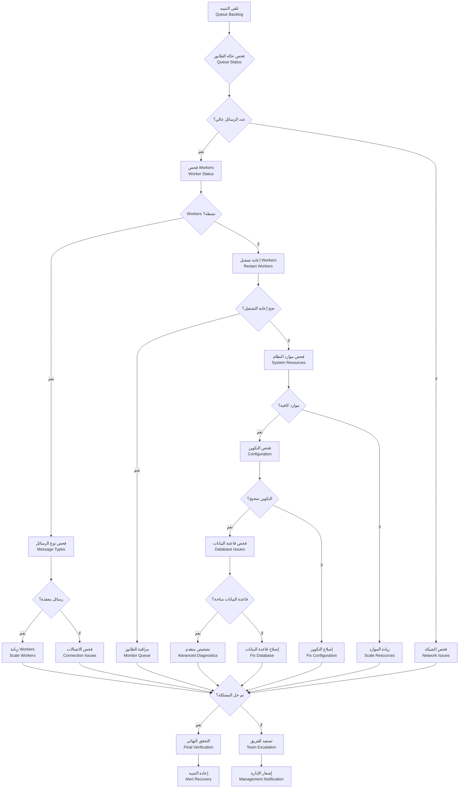
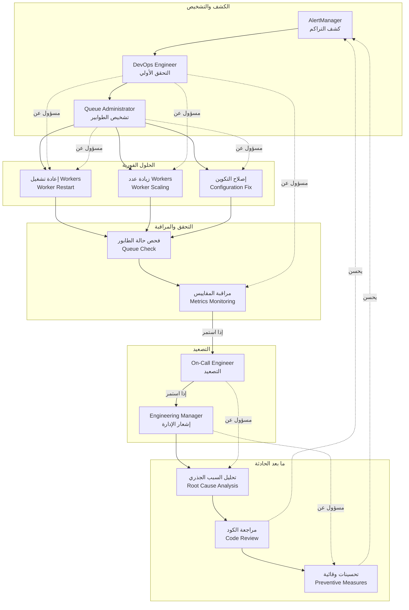

# Runbook — Queue Backlog (تراكم الطابور)

## نظرة عامة

حادث: تراكم الرسائل في الطوابير (RabbitMQ/Redis Queue) مما يؤدي لتأخر في المعالجة.

**الأولوية**: عالية (P1) - يؤثر على معالجة المهام
**MTTR هدف**: 10 دقائق
**MTTD هدف**: 2 دقيقة

## مخطط الإجراءات (Action Flowchart)



## مخطط مسؤوليات الفريق (Team Responsibilities Swimlane)



## الأعراض والكشف

### الأعراض الرئيسية

- **تنبيهات Grafana**: `rabbitmq_queue_messages > 1000`
- **تأخر في المعالجة**: زمن معالجة أطول من 5 دقائق
- **تراكم في الطوابير**: رسائل معلقة لساعات
- **أخطاء في التطبيق**: Queue timeout أو connection errors

### كيفية الكشف

```yaml
# alerts/queue-backlog.yml
groups:
  - name: queues
    rules:
      - alert: QueueBacklogDetected
        expr: rabbitmq_queue_messages > 1000
        for: 5m
        labels:
          severity: warning
        annotations:
          summary: 'تراكم في الطوابير'
          runbook_url: 'https://kb.kaleem-ai.com/runbooks/queue-backlog-incident'
```

## خطوات الحل

### الحلول الفورية (المستوى 1)

```bash
# إعادة تشغيل Workers
kubectl rollout restart deployment/workers

# زيادة عدد Workers
kubectl scale deployment workers --replicas=5

# فحص حالة الطوابير
kubectl exec rabbitmq-pod -- rabbitmqctl list_queues
```

### الحلول المتقدمة (المستوى 2)

```typescript
// تحسين معالجة الرسائل
async processMessageOptimized(message: any) {
  // معالجة بالتوازي
  const promises = messages.map(msg => this.processSingle(msg));
  await Promise.allSettled(promises);

  // تنظيف الطابور
  await this.queue.purge();
}
```

## التحقق والمراقبة

```bash
# فحص حالة الطوابير
rabbitmqadmin list queues

# فحص Workers
kubectl top pods -l app=workers

# مراقبة المقاييس
curl http://localhost:3000/metrics | grep queue
```

---

_تم إنشاء هذا الـ runbook بواسطة فريق العمليات في كليم_
